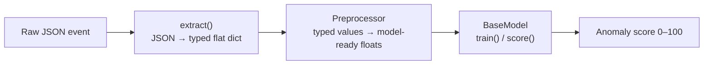
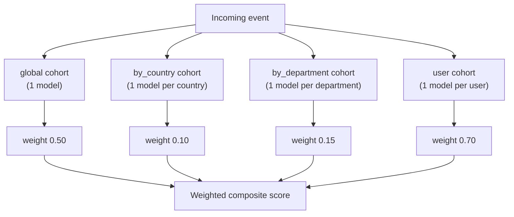

# ALF - Anomaly Log Finder
Detects anomalies in structured logs/events using unsupervised machine learning (e.g. neural-network autoencoder with embeddings and/or isolation forest).


## Summary 

A REST API that receives arbitrary JSON events/log and returns an anomaly score (0–100) for each, compared against a baseline of previously seen events. Designed primarily for security or authentication event analysis, but fully domain-agnostic via configuration.

---


The http application exposes two endpoints:

- **`POST /ingest`** — add an event to the model baseline (training)
- **`POST /score`** — score an event against the learned baseline (determining if its an anomaly)

Every request passes through a pipeline of **extractors** (structured parsing), **preprocessors** (numeric normalisation), and one or more **models**. Multiple independent models run in parallel as **cohorts** — for example one global model, one model per country, and one model per user. Their scores are combined into a single composite score.

---

## High-Level Technical Overview

### Event pipeline



**Stage 1 — `extract()`**: Walks the nested JSON, applies per-type structural logic (parsing json from a string, expanding a timestamp into hour/weekday/etc.), and returns a flat `dict[field_name → (value, FieldConfig)]`.

**Stage 2 — `Preprocessor`**: Converts each typed value to a model-ready float using a stateful per-field preprocessor (e.g. `StandardScaler`, `OneHotEncoder`). Returns `dict[FieldInfo → float]`.

**Stage 3 — model**: Receives the preprocessed float dict. Either learns from it (`train`) or returns a score (`score`).

---

### Cohorts — models keyed by feature values

A **cohort** is a named group of models that each serve a specific slice of the data. The cohort key is derived by reading one or more fields from the incoming event.

```
cohort "user"   fields: ["user.id"]
  ├── model for user@example.com
  ├── model for alice@example.com
  └── model for bob@example.com   ← each event hits exactly ONE of these
```

```
cohort "by_country"   fields: ["ip.country_iso"]
  ├── model for DE
  ├── model for UK
  ├── model for FR
  └── model for US   ← each event hits exactly ONE of these
```

A cohort with `fields: []` is a **global model** — all events go to the same instance.

Every cohort scores every request. Their scores are combined into a weighted composite. Cohorts that have not yet completed initial training contribute `score=None`; composite weights are renormalized over trained cohorts only.



Each cohort routes to exactly one model instance per event. The `by_country` cohort, for example, maintains a separate model for each distinct country value it has ever seen, and an incoming event from Germany hits only the Germany model.

---

## Technical Details

### 1. Extractors

Extractors live in `app/features/extractors/`. To add a new extractor, create a new file there implementing the `FieldHandler` and register it in `app/features/extractor.py`.

| Type | What it produces | Parameters |
|---|---|---|
| `numeric` | Single float | — |
| `boolean` | `1.0` / `0.0` | — |
| `str_categorical` | Raw string (low-cardinality) | — |
| `str_identifier` | Raw string (high-cardinality, unbounded) | — |
| `ip_address` | IPv4 → `.o1 .o2 .o3 .is_private`; IPv6 → `.subnet_hash .is_private` | — |
| `semver` | `.major .minor .patch` | — |
| `timestamp` | `.hour .dayofweek .is_weekend .is_business_hours` | — |
| `json_expand` | Parses a JSON-encoded string field; recursively applies sibling field configs to the parsed object | — |
| `ignore` | Drops the field entirely | — |

There are extractors, that expand into multiple sub-fields (**`json_expand`**, **`timestamp`** etc.). The expanded sub-fields come with sensible default types, but you can override them in the config by adding entries that name the expanded path:

```yaml
features:
  global:
    timestamp: timestamp
    # Override the default type of an expanded sub-field:
    timestamp.hour: numeric
    myStringPropertyWithJson: json_expand
    # Add config for a field inside the JSON-encoded blob:
    myStringPropertyWithJson.further.valueA: str_categorical
```

**Field aliasing with `source`**: A field can read from a different JSON path using `source`. Useful when you want to rename or duplicate a field:

```yaml
features:
  global:
    country_code:
      type: str_categorical
      source: ip.country_iso   # reads from this path, outputs as "country_code"
    country_code_2":
      type: str_categorical
      source: ip.country_iso   # reads from this path, outputs as "country_code_2"
```

---

### 2. Preprocessors

Preprocessors live in `app/features/preprocessors/`. To add a new preprocessor, create a file there implementing the `FieldPreprocessor` base and register it in `app/features/preprocessors/__init__.py`.

Each model algorithm ships with per-type defaults (see section 3). Override any default in the field config:

```yaml
features:
  global:
    latency:
      type: numeric
      preprocessor:
        name: MinMaxScaler     # override the default StandardScaler
    user_agent.agent.name:
      type: str_categorical
      preprocessor:
        name: OneHotEncoder
        params:
          n_categories: 50   # increase from default 10
```

| Preprocessor | Output | Stateful | Parameters | Notes |
|---|---|---|---|---|
| `StandardScaler` | z-score float, clipped to `[-5, 5]` | yes | — | Default for `numeric`. Robust to outliers — a single extreme value shifts mean/std by O(1/n). |
| `MinMaxScaler` | float in `[0, 1]` | yes | — | Correct for bounded sub-fields (timestamp parts, IP octets, semver). Avoid for unbounded numerics. |
| `PassThrough` | raw float unchanged | no | — | Default for `boolean`. |
| `OneHotEncoder` | N binary floats (`field__1` … `field__N`) | yes | `n_categories` (default 10) | Default for `str_categorical` in HST. Unseen values at score time produce all-zeros — a distinct novelty signal. Raises `ValueError` if vocabulary exceeds `n_categories`. |
| `OneHotHashEncoder` | 1 float per hash bucket | no | `n_features` (default 2000) | Default for `str_identifier` in HST. Stateless, deterministic (seed=0). |
| `LabelIndex` | integer vocab index (0 = missing) | yes | — | Default for `str_categorical` in Autoencoder. Routes to an embedding table. Captures co-occurrence patterns. |
| `HashIndex` | integer hash index | no | `n_features` (default 2000) | Default for `str_identifier` in Autoencoder. Routes to an embedding table. Stateless. |
| `FrequencyEncoder` | float in `[0, 1]` (how common the value is) | yes | — | Override only. Unseen values → `0.0`. |

---

### 3. Models

Models live in `app/models/`. To add a new algorithm, create a subclass of `BaseModel` (see `app/models/base.py`) and register its class name in `app/models/factory._REGISTRY`.

#### HalfSpaceTrees (HST)

Streaming isolation-forest algorithm ([River library](https://riverml.xyz/)). Maintains a two-buffer batch window; pivots every `window_size` events. Ideal for streaming ingestion with low memory.

| Parameter | Default | Effect |
|---|---|---|
| `n_trees` | 25 | Number of isolation trees. More trees → more stable scores, more memory. |
| `height` | auto | Tree depth. Auto-derived as `floor(log₂(window_size / 10))`. Higher height needs more data per leaf. |
| `window_size` | 250 | Events per window. Controls the reference period. |
| `sliding_steps` | 1 | Number of staggered model slices. `sliding_steps=N` reduces maximum reference staleness from `window_size` to `window_size / N`, at N× memory cost. |

**Default preprocessors (HST):**

| Feature type | Preprocessor |
|---|---|
| `numeric` | `StandardScaler` |
| `boolean` | `PassThrough` |
| `str_categorical` | `OneHotEncoder` |
| `str_identifier` | `OneHotHashEncoder` |

#### Autoencoder (AE)

PyTorch autoencoder with entity embeddings. Scores events by their reconstruction error relative to a percentile baseline. Supports categorical co-occurrence learning via embedding tables.

| Parameter | Default | Effect                                                                                                                                                                   |
|---|---|--------------------------------------------------------------------------------------------------------------------------------------------------------------------------|
| `buffer_size` | 500 | Rolling event buffer capacity. Oldest events are evicted when full.                                                                                                      |
| `min_buffer_size` | 64 | Model is not built until this many events have been buffered.                                                                                                            |
| `retrain_every` | 50 | Retrain after every N ingest events.                                                                                                                                     |
| `epochs_per_retrain` | 2 | Iterations over the event buffer (limited by `buffer_size`) used for training per retrain cycle. Keep low (1–5) — warm-start weights already encode historical baseline. |
| `embed_dim` | 8 | Embedding dimension cap per categorical field. Actual dim = `min(embed_dim, vocab_size // 2 + 1)`.                                                                       |
| `bottleneck` | auto | Latent dimension. Auto = `max(total_input_dim // 2, 2)`.                                                                                                                 |
| `vocab_headroom` | 50 | Extra embedding table rows pre-allocated beyond vocabulary observed or expected at model-build time.                                                                     |
| `lr` | 0.001 | Adam learning rate.                                                                                                                                                      |
| `seed` | None | Weight initialisation seed. None = non-deterministic.                                                                                                                    |

**Default preprocessors (Autoencoder):**

| Feature type | Preprocessor |
|---|---|
| `numeric` | `StandardScaler` |
| `boolean` | `PassThrough` |
| `str_categorical` | `LabelIndex` |
| `str_identifier` | `HashIndex` |

#### Using a model in config

```yaml
cohorts:
  - name: "global"
    features_config: "global"
    fields: []
    weight: 0.5
    model:
      name: Autoencoder          # or: HalfSpaceTrees
      params:
        buffer_size: 5000
        min_buffer_size: 100
        retrain_every: 50
        epochs_per_retrain: 2
```

---

### 4. Putting it together — feature configs and cohorts

Multiple **feature configs** can be defined so different cohorts see different input fields. This is useful when, say, a per-user cohort should see authentication method but a global cohort should not.
You can also use different models for different cohorts (e.g. as global model you want to use an isolation forest, for user models you want to use Autoencoder)

```yaml
features:
  global:
    ip.country_iso: str_categorical
    latency: numeric

  user: # only user cohort sees these features
    ip.country_iso: str_categorical
    latency: numeric
    authMethod: str_categorical

cohorts:
  - name: "global"
    features_config: "global"     # ← references the features block above
    fields: []                    # ← one model, all events 
    weight: 0.50
    model: { name: Autoencoder, params: { ... } }

  - name: "user"
    features_config: "user"         # ← different feature set
    fields: ["user.id"]             # ← each user as its own model, events are routed to the users model
    weight: 0.70
    model: { name: Autoencoder, params: { ... } }
```

---

### 5. Scoring

**Composite score** is a weighted average of all trained cohort scores. Untrained cohorts (score = `null`) have their weight redistributed proportionally across trained cohorts.

```
composite = Σ(weight_i × score_i) / Σ(weight_i)   [trained cohorts only]
```

**Score labels** (`app/orchestration/labels.py`):

| Label | Score range |
|---|---|
| `INSUFFICIENT_DATA` | score is `null` (no cohort trained yet) |
| `NORMAL` | < 30 |
| `SLIGHTLY_ELEVATED` | 30–49 |
| `ELEVATED` | 50–69 |
| `ANOMALOUS` | 70–84 |
| `HIGHLY_ANOMALOUS` | ≥ 85 |

**HST score mapping**: `score_one()` returns `[0, 1]` where 1 = most anomalous → `clip(raw × 100, 0, 100)`.

**Autoencoder score mapping**: Reconstruction MSE is converted to a percentile rank within the baseline MSEs from the last retrain. The raw percentile is remapped through a piecewise-linear function so label boundaries align with the canonical thresholds above (80th percentile → 30, 90th → 50, 95th → 70, 99th → 85).

---

### 6. Identifiers

Top-level `identifiers` config lists field paths used to label events in output. They are **not** used for scoring.

```yaml
identifiers:
  - event.id
  - user.id
```

---

### 7. Model storage

Model state is serialised as a pickle blob and stored in the configured backend.

```yaml
# In-memory (lost on restart — for development / testing)
database:
  type: memory
```

```yaml
# SQLite (persists across restarts)
database:
  type: sqlite
  path: "data/anomaly.db"
```

**LRU cache for large cohorts** (useful if many models will be created per cohort, a good example is the  user cohort):

When a cohort can produce many distinct model instances (e.g. one per user), keeping all of them in RAM is impractical. Set `lru_size` to keep only the most recently used N instances in RAM; evicted instances are serialised to the store and reloaded on demand.

| Config | Behaviour |
|---|---|
| `lru_size` omitted | All cohort instances live in RAM forever (suitable for bounded cohorts like countries or departments) |
| `lru_size: 0` | LRU cache with zero capacity — every access loads from the store and immediately evicts; effectively disables in-RAM caching |
| `lru_size: 1` | Only the single most recently used instance stays in RAM |
| `lru_size: 1000` | The 1000 most active users stay in RAM; the rest are paged to SQLite on demand |

```yaml
cohorts:
  - name: "user"
    fields: ["user.id"]
    lru_size: 1000       # keep top-1000 active users in RAM
    model: { name: Autoencoder, params: { ... } }
```

---

## Model Behaviour In Depth

### HalfSpaceTrees

HST is an **isolation-based** streaming anomaly detector. It builds a forest of random half-space partitions. Rare events (that fall into sparse leaf regions) are isolated quickly and score high.

#### Window mechanism

HST uses a **two-buffer batch approach**, not a true sliding window:

1. `l_mass` accumulates the current window of `window_size` events.
2. When `window_size` events have been ingested: `r_mass = l_mass`, `l_mass` resets → this is called a **pivot**.
3. `score_one()` scores against `r_mass` (the previous complete batch only).
4. **During the first window**: no scoring — the model returns `null` and `is_trained = False`.

This means the maximum lag from a behaviour change to being reflected in the baseline is up to `2 × window_size` events (worst case: change happens right after a pivot).

#### Staggered slices (`sliding_steps > 1`)

With `sliding_steps=N`, N `ModelSlice` instances are maintained in staggered phases, each offset by `window_size / N` events. Scoring picks the slice with the lowest `recency` (most recently pivoted). Maximum reference staleness: `window_size / N − 1` events. Cost: N× memory and compute.

Example: `window_size=500, sliding_steps=5` → freshest slice is always within 100 events of now instead of 500.

#### Choosing `height` and `window_size`

The key constraint is that the average leaf mass must exceed River's internal threshold of `0.1 × window_size`:

```
window_size / 2^height  ≥  0.1 × window_size
  →  height  ≤  floor(log₂(window_size / 10))
```

| `window_size` | max `height` |
|---|---|
| 100 | 3 |
| 500 | 5 |
| 1 000 | 6 |
| 2 000 | 7 |
| 2 560+ | 8 |

**Diagnostic**: after the first pivot, request `?explain=true` and check `baseline_score` (score for an all-mean event). If it is above 30, reduce `height` or increase `window_size`.

#### `n_trees` guidance

| `n_trees` | When to use |
|---|---|
| 10–15 | RAM-constrained |
| 25 | Good default |
| 50 | High-stakes detectors where score stability across pivots matters |

#### Explanation

The HST `?explain=true` response uses a **build-up from neutral baseline** approach. `baseline_score` is the score when all features equal their window mean. Each field's `delta` is `score({this field actual, all others at mean}) - baseline_score`. Fields are sorted by `|delta|` descending.

---

### Autoencoder

The Autoencoder learns to reconstruct **normal events**. Events the model struggles to reconstruct (high MSE) score high. It uses **entity embeddings** for categorical fields — the model learns that certain value combinations (e.g. "Chrome + Linux") are normal, even if each individual value is common on its own.

#### Warm-start retraining

Every `retrain_every` ingest events, the model retrains on its rolling buffer of `buffer_size` events. Critically, **weights are not reset between retrains**. They carry weight-level memory of long-term normal behaviour far beyond the hard data boundary of the rolling buffer.

Example: with `buffer_size=5000` and `retrain_every=50`, the buffer covers the last 5000 events. But the weights encode gradient history from every retrain ever run — years of baseline behaviour if the service has been running long enough.

#### Why fixed epochs?

Loss-based early stopping would run more epochs when anomalous events are in the buffer (harder to fit), giving those events disproportionate gradient influence. Fixed `epochs_per_retrain` guarantees every event receives equal gradient exposure over the model's lifetime.

#### Feature order and vocabulary

Feature order is fixed once at model-build time (when `min_buffer_size` events have been buffered). New fields appearing after model build are rejected with `ValueError` — reset the model to incorporate them.

Embedding table size is pre-allocated as `observed_vocab + vocab_headroom`. If a new categorical value appears between retrains and exhausts the headroom, `score()` raises `ValueError`. Increase `vocab_headroom` or decrease `retrain_every` to fix this.

#### Embedding behaviour

`str_categorical` fields (via `LabelIndex`) and `str_identifier` fields (via `HashIndex`) are routed to per-field embedding tables. The autoencoder's bottleneck compresses all embedding vectors jointly, learning cross-field co-occurrence patterns. Example: a user-agent combination the model has never seen reconstructs poorly even if each individual value was common alone.

#### Explanation

AE `?explain=true` uses **proportional field attribution**: `delta = (field squared error / total squared error) × score`. No neutral baseline is needed — reconstruction error is already localised to each field's slice of the input vector. `baseline_score` is always `0.0` for the AE.

---

## Testcase Structure

All testcases live under `testcases/`. They are organised into subdirectories by category:

```
testcases/
  half_space_trees/      # HST model behaviour testcases
    cold_start/
    known_pattern/
    numeric_spike/
    sliding_window/
    useragent_os_shift/
    ...
  autoencoder/           # Autoencoder model behaviour testcases
    cold_start/
    multivariate_combo/
    ...
  extractor/             # Feature extraction testcases (no model)
    timestamp/
    ip_address_ipv4/
    json_expand/
    source_alias/
    ...
  preprocessor/          # Preprocessor-specific testcases
    standard_scaler/
    one_hot_encoder/
    label_index/
    ...
```

### Testcase layout

Each subdirectory is one parametrized test case run by `tests/test_detector_cases.py`. A case may have one or more numbered steps (`input_001.json`, `input_002.json`, …). Steps run sequentially within a single app instance — model state accumulated during `input_001.json` carries over into `input_002.json`. Use multiple steps to test behaviour across training phases (e.g. before and after a pivot).

| File | Purpose |
|---|---|
| `config.yaml` | Full app config for this testcase (`database: type: memory`) |
| `input_NNN.json` | `{ "ingest": [...], "scores": [...] }` |
| `output_NNN_ingest.json` | Golden `/ingest?include_features=true` responses |
| `output_NNN_score.json` | Golden `/score?explain=true` responses |

### Running tests

```bash
# Run all testcases
uv run pytest tests/ -v

# Run a single testcase
uv run pytest tests/test_detector_cases.py::test_detector_case[half_space_trees/cold_start] -v
```

### Regenerating golden outputs

After any change to model logic, feature extraction, or testcase inputs:

```bash
uv run python scripts/regen_testcase_outputs.py
```

---

## Debugging

Set `debug.dump_results: true` in `config.yml` to dump every request/response to `.train_and_detect/<date>/<session>/`:

```yaml
debug:
  dump_results: true
```

Each API session creates a numbered directory (e.g. `.train_and_detect/2026_05_16/001/`) containing:
- `input.json` — ingest payloads with extracted features
- `output.json` — score responses with composite scores and cohort breakdowns

---

## Train and Detect from Elasticsearch

`scripts/train_and_detect.py` fetches events from Elasticsearch, trains on a 3-week baseline window, then scores the most recent week and prints a results table.

**Default time windows**:
- Training: `now-4w` → `now-1w`
- Detection: `now-1w` → `now`

**Local mode** (`--local`) runs the anomaly API in-process using FastAPI's `TestClient`. Both training and detection share one in-memory app instance so model state is preserved between phases — no external server needed.

```bash
uv run python scripts/train_and_detect_from_elastic.py \
    --es-url https://es.example.com:9200 \
    --es-api-key YOUR_API_KEY \
    --index auth-logs \
    --local \
    --filter 'department: "EXAMPLE-DEPT"' \
    --anomalous-only \
    --explain
```

| Flag | Default | Purpose |
|---|---|---|
| `--es-url` | env `ES_URL` | Elasticsearch base URL |
| `--es-api-key` | env `ES_API_KEY` | API key (the encoded value) |
| `--index` | env `ES_INDEX` | Index or data-view name |
| `--api-url` | env `ANOMALY_API_URL` | Anomaly API URL (ignored with `--local`) |
| `--local` | false | Run API in-process; no external server needed |
| `--config` | `config.yml` | Config file path (used with `--local`) |
| `--filter` | none | Lucene filter applied to both training and detection queries |
| `--train-from` | `now-4w/d` | Training window start (ES date math) |
| `--train-to` | `now-1w/d` | Training window end |
| `--detect-from` | `now-1w/d` | Detection window start |
| `--detect-to` | `now/d` | Detection window end |
| `--page-size` | 500 | Documents per ES page |
| `--anomalous-only` | false | Only display anomalous events in output |
| `--explain` | false | Print top-5 field-level attribution per event |

---

## Running the Service

```bash
# Start the API
uv run uvicorn app.main:app --reload

# Run tests
uv run pytest tests/ -v

# Sync dependencies
uv sync --all-packages
```

Config is read from `CONFIG_PATH` env var, defaulting to `config.yml` at the repo root. Always use `uv run` — the `.venv` Python symlinks are broken.
